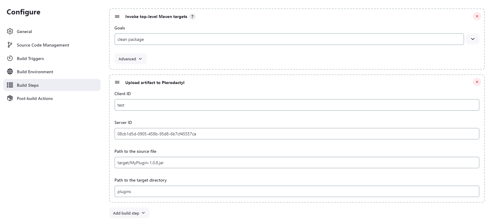

# Pterodactyl Plugin

## Introduction

A Jenkins plugin to work with to [Pterodactyl Panel](https://pterodactyl.io/) using [Pterodactyl4J](https://github.com/mattmalec/Pterodactyl4J/)

Use cases:
- Automatic artifact deployment

## Getting started
### API token
Pterodactyl has two distinct APIs:
- Client API: bounds a specific user, can access user information and permitted servers
- Application API: bounds to the panel, can access location, node, egg, database, server, user, etc

To create an API token:
- Client API: Account settings >
  API Credentials
- Application API: Admin > Application API

To configure the token store:
- Go to Manage Jenkins > System > Pterodactyl Plugin Configuration
- Specify client or application configuration to continue

### Upload artifact
For example, you have set up a job to clone a Git repo and use Maven to build the project. To upload the compiled file to a Pterodactyl server, go to the job configuration, add a new step "Upload artifact to Pterodactyl":
- ClientId: Refer to the ID of client configuration
- ServerId: The Pterodactyl server ID
- SourceFile: The path to the file/directory to be uploaded
  + The root is the job's workspace under `workspace/<job name>/`
- TargetDirectory: The path to the target directory
  + The directory must exist on the Pterodactyl server
  + When uploading a directory, subdirectories are automatically created. However, the root must exist.

### Logging
Go to Manage Jenkins > System Log.
